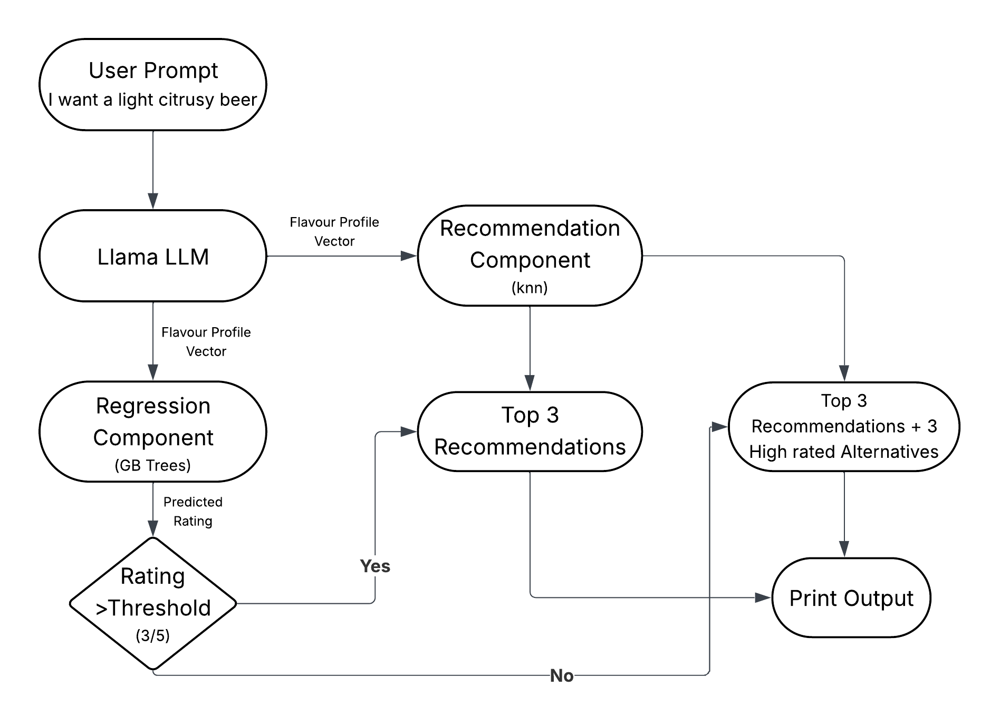

# Rating-Aware Beer 🍺 Recommendation System

This is an intelligent beer recommendation system that combines **predictive quality assessment** with **similarity-based recommendations** to provide both what users want and educational guidance about better alternatives.

Simply give a prompt describing what you are craving, and the system will:

- Predict how well the beer flavor profile rates.
- Provide a comprehensive recommendation for that flavor.

But that's not all! If the flavor profile rates poorly, the system will:

- Warn the user.
- Suggest other similar-flavored, high-rated beers.

Enjoy smarter beer choices tailored just for you!

#### Note: This Project also has web app ready for use : https://recommendbeer.streamlit.app/ Enjoy!

## System Architecture

The solution or pipeline consists of four integrated components:

1. **Natural Language Processing Pipeline**
   - Converts user queries like "light citrusy beer" into numerical flavor profiles
   - Uses Groq's Llama 3.1 model with structured prompting
   - Handles 12 flavor dimensions + style classification

2. **Rating Prediction Component**
   - Gradient Boosted Trees model predicts beer quality (1-5 stars)
   - Trained on flavor profiles to predict user satisfaction
   - Acts as quality gate for recommendations

3. **Recommendation Engine**
   - K-Nearest Neighbors finds similar beers based on flavor profiles
   - Content-based filtering by mainstream/craft and alcohol strength
   - Bayesian quality scoring incorporating review volume

4. **Intelligent User Interface**
   - Warns users about potentially disappointing flavor combinations
   - When predicted rating < 3.0/5, alerts users about potentially disappointing choices
   - Provides exact matches for user requests
   - Suggests higher-rated alternatives when needed
   - Educational messaging about flavor compatibility

## Dataset Used

The comprehensive [Beer Profile and Ratings Dataset](https://www.kaggle.com/datasets/ruthgn/beer-profile-and-ratings-data-set) containing 33,000+ beer reviews with detailed flavor profiles.

## Flow Chart



## Data Preprocessing and Feature Engineering

* Removed unneeded columns (IBU ranges, individual review components, name fields)
* Added 'mainstream' binary feature to classify mass-market vs craft beers
* Created 'strength' categorical feature based on ABV ranges (Light/Medium/Strong/Extra Strong)

## Regression Component

* **Data preparation**: Applied one-hot encoding for categorical features and min-max scaling for numerical features
* **Model comparison**: Evaluated Linear Regression vs Gradient Boosted Trees (GBT outperformed with lower MSE)
* **Final model**: Trained Gradient Boosted Trees with optimized hyperparameters (`n_estimators=150, learning_rate=0.1, max_depth=4`)

## LLM Wrapper

* **Natural Language Processing**: Implemented LLM wrapper using Groq's Llama 3.1 model with custom system prompt
* **Feature Translation**: Converts natural language beer preferences into structured numerical flavor profiles
* **Intelligent Parsing**: Handles complex descriptors like "light citrusy" and maps them to appropriate feature values

### Example Transformation:

**Input:** "I want a light citrusy beer"

↓ LLM Wrapper ↓

**Output:**
```json
{
  "ABV": 4.2,
  "Astringency": 12,
  "Body": 35,
  "Alcohol": 15,
  "Bitter": 45,
  "Sweet": 40,
  "Sour": 85,
  "Salty": 0,
  "Fruits": 140,
  "Hoppy": 65,
  "Spices": 15,
  "Malty": 50,
  "mainstream": 1,
  "style": "Wheat Beer"
  "region": None
}
```

## Recommendation Component

* **Test Point Generation**: Takes LLM output and creates test datapoint with proper scaling and encoding
* **Content-Based Filtering**: Subsets dataset according to hard filters (mainstream/craft preference, alcohol strength categories)
* **Similarity Search**: Uses K-Nearest Neighbors with configuration `NearestNeighbors(n_neighbors=10, metric='euclidean')`
* **Custom Quality Scoring**: Applies custom Bayesian averaging formula incorporating review volume for final ranking
* **Rating-Aware Display**: 
  - If predicted rating ≥ 3.0: Shows standard recommendations with positive messaging
  - If predicted rating < 3.0: Displays warning about flavor combination, provides exact matches, and suggests better-rated alternatives

### Example Outputs:

#### Good Combination (Rating ≥ 3.0):

```
━━━━━━━━━━━━━━━━━━━━━━━━━━━━━━━━━━━━━━━━━━━━━━━━━━━━━━━━━━━━
✅ Great choice! Predicted rating: 3.75/5
━━━━━━━━━━━━━━━━━━━━━━━━━━━━━━━━━━━━━━━━━━━━━━━━━━━━━━━━━━━━

🍺 Top Recommendations:

1. Sunshine Pils
   Rating: 4.06/5 (533 reviews)
   Distance: 0.878
   Notes: Like the rising sun, Sunshine Pils delivers winter, spring, summer and fall...

2. Pikeland Pils
   Rating: 4.14/5 (318 reviews)
   Distance: 0.902
   Notes: OG 11 ºP / 44 IBUs...

3. Scrimshaw Pilsner
   Rating: 3.93/5 (576 reviews)
   Distance: 0.828
   Notes: Named for the delicate engravings popularized by 19th century seafarers...
```

#### Problematic Combination (Rating < 3.0):

```
━━━━━━━━━━━━━━━━━━━━━━━━━━━━━━━━━━━━━━━━━━━━━━━━━━━━━━━━━━━━
⚠️  Warning: This flavor combination typically rates 2.90/5
━━━━━━━━━━━━━━━━━━━━━━━━━━━━━━━━━━━━━━━━━━━━━━━━━━━━━━━━━━━━

📍 Here's what matches your exact request:
1. The Kaiser (3.65★ - 581 reviews)
   Distance: 0.903
2. Hevelius Kaper (3.32★ - 83 reviews)
   Distance: 0.830
3. Labatt Max Ice (3.11★ - 60 reviews)
   Distance: 0.859

💡 Suggested Alternatives (similar but better rated):
1. Abt 12 (4.33★ - 2217 reviews)
   Distance: 1.546
2. Three Philosophers (3.99★ - 1683 reviews)
   Distance: 1.546
3. The Kaiser (3.65★ - 581 reviews)
   Distance: 0.903

💭 Tip: The flavor combination you requested is uncommon. The alternatives above
   maintain similar characteristics but with proven appeal to beer enthusiasts.

────────────────────────────────────────────────────────────
```

## Dependencies

```python
pandas
numpy
scikit-learn
groq
python-dotenv
```

## Setup

1. Clone the repository
2. Install required packages: `pip install -r requirements.txt`
3. Set up your Groq API key in a `.env` file:
   ```
   GROQ_API_KEY=your_api_key_here
   ```
4. Run the Jupyter ```(beer_v2.ipynb)``` notebook

## Usage

To get beer recommendations, simply provide a natural language description of what you're looking for:

```python
# Get LLM interpretation of your request
llm_output = get_beer_features_from_text("I want a light citrusy beer")

# Get recommendations
recommendations = get_beer_recommendations(llm_output, X_recommend, y_recommend)
```
